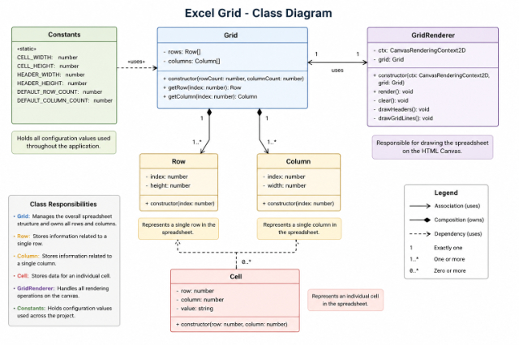

# Custom High-Performance Excel Canvas Engine

An Excel-like custom spreadsheet engine built from scratch using TypeScript, HTML5 Canvas, and clean architectural principles. The project features a virtualized rendering viewport matrix capable of handling a massive grid layout of **100,000 Rows × 500 Columns** smoothly at 60 FPS without browser DOM bloat or memory lag.

---

## 🚀 Installation & Running the Project

### 1. Extract and Mount Environment
Ensure Node.js is installed. Open the project root directory in your terminal.

### 2. Install Dependencies
```bash
npm install
```

### 3. Start Development Server (Vite)
```bash
npm run dev
```
*Open the provided local URL (typically `http://localhost:5173`) in your browser to test the interactive sheet.*

### 4. Build the Project for Production
```bash
npm run build
```

### 5. Preview the Production Build Locally
```bash
npm run preview
```

---

## 🛠️ Features Implemented

- **Virtual Grid Infrastructure**: Handled via a single HTML5 canvas layer running smooth 60 FPS virtual viewport computations across 100,000 rows and 500 columns.
- **Dynamic Mouse-Drag Component Resizing**: Includes column-width and row-height resize adjustments. Uses `col-resize` and `row-resize` interactive pointer styles clamped cleanly above safety configurations floors.
- **Semantic Text Field Overlays**: Spawns an HTML `<input>` textbox positioned exactly over target cell bounding matrices for smooth text selection and editing.
- **Bi-Directional Context Selection Loops**: Supports clicking and dragging mouse selections, highlighting ranges, or clicking row or column header tags to select full tracks.
- **Live Out-of-Screen Summary Component**: Real-time evaluation of data targets (`Count`, `Sum`, `Avg`, `Min`, `Max`) displayed inside semantic HTML strings below the drawing region.
- **4-Way Keyboard Matrix Navigation**: Uses `ArrowUp`, `ArrowDown`, `ArrowLeft`, and `ArrowRight` arrow keys to change cell focus. Includes automatic canvas positioning to keep the active cell in view.
- **Command Architecture Timeline Tracking**: Built-in transactional interceptors mapping `Ctrl+Z` (Undo) and `Ctrl+Y` (Redo) histories across all edit mutations and cell/row width resizing changes.
- **Dummy Asset Data Loader Pipeline**: Automatically compiles a localized dataset of **50,000 unique records** instantly upon launch.

---
## 📂 System Folder & Class Structure

```text
src/
├── core/
│   ├── Grid.ts                # App Brain. Binds events, transforms clicks, tracks keystrokes
│   ├── Row.ts                 # Row model. Validates height metrics above safety floor constraints
│   ├── Column.ts              # Column model. Width validation + translates numbers to labels (e.g., AA)
│   └── Cell.ts                # Cell model. Tracks coordinate bounds and string values
├── renderer/
│   └── GridRenderer.ts        # Pure Drawing Pipeline. Paints grids, texts, markers, and headers
├── commands/
│   ├── ICommand.ts            # Abstract Interface Contract for Undo/Redo operations
│   ├── CommandManager.ts      # History Lifespan Handler. Manages Undo/Redo transaction arrays
│   ├── EditCommand.ts         # Cell data change history transaction tracking script
│   ├── ResizeColumnCommand.ts # Column width adjustment history transaction execution script
│   └── ResizeRowCommand.ts    # Row height adjustment history transaction execution script
├── data/
│   ├── GridDataStore.ts       # Coordinate Data Engine. Coordinates lookups via custom coordinate keys
│   └── JsonLoader.ts          # Automated Dataset Mock Generator. Builds 50,000 data profiles
├── config/
│   └── GridConfig.ts          # Central Configuration File. Theme colors, boundary floors, constants
└── utils/
    └── Types.ts               # Shared TypeScript data type interface schemas
```

---

### 📊 System Class Diagram


## 🏛️ Design Explanation & Principles Applied

### 1. Object-Oriented Programming (OOP) Blueprint
- **Encapsulation**: Models (`Cell`, `Row`, `Column`) encapsulate internal layout bounds. They expose structured accessors and mutators (such as `.setWidth()`) that run defensive runtime clamping checks.
- **Abstraction**: `Grid.ts` hides its complex sub-systems. External modules trigger actions like `grid.render()` without needing to manage internal trackpad scroll calculations or matrix updates.
- **Polymorphism**: The Undo/Redo history tracking system relies entirely on structural subtyping. The `CommandManager` works with the generic interface abstraction `ICommand`, treating data changes and resizing actions identically through common execution signatures.

### 2. SOLID Design Clean-Code Compliance
- **S – Single Responsibility Principle (SRP)**: Each class manages exactly one domain workflow. `GridRenderer` focuses strictly on drawing pixels and has no concept of database storage, while `JsonLoader` focuses entirely on assembling data arrays.
- **O – Open/Closed Principle (OCP)**: The spreadsheet's action logs are completely open to extension but closed to modification. To add features like cell background coloring or border styling, developers can introduce a new class implementing `ICommand` without rewriting the core timeline tracking engine.
- **L – Liskov Substitution Principle (LSP)**: Classes like `ResizeColumnCommand` can be substituted interchangeably wherever an abstract `ICommand` type contract signature is expected. This approach preserves safe runtime operations without crashing execution loops.
- **I – Interface Segregation Principle (ISP)**: Interaction interfaces are deliberately segregated. For instance, the system tracks specific isolated data types (such as `VisibleArea` bounds or `SummaryData` matrices), avoiding bloated configurations.
- **D – Dependency Inversion Principle (DIP)**: High-level management modules do not depend directly on concrete sub-classes. `Grid.ts` works with abstract references like `ICommand` interfaces and structural helper models, decoupling the system from hardcoded component instances.

### 3. Command Pattern Framework
When an event changes data values or row/column sizes, the engine encapsulates the target reference, the previous configuration value, and the new targeted value into a custom execution payload matching the generic `ICommand` interface. 

The `CommandManager` pushes this transactional object onto an internal history history sequence tracker. Pressing `Ctrl+Z` pops the top element off the stack and executes its precise `.undo()` routine, restoring historical parameters instantly.

```text
 User Interaction (Edit/Resize)
            │
            ▼
 Instantiates Concrete Command Object (e.g., EditCommand)
            │
            ▼
 Sent to CommandManager.execute(command)
            │
 ───────────┴───────────
 │                     │
 ▼                     ▼
Runs .execute()     Pushed onto undoStack
                       │
                       ▼
            [ Redo Stack Cleared ]
```

---
## 🔄 Dynamic System Workflows

### 1. Virtual Viewport Rendering Mechanics
Allocating 50 million cell nodes for a 100,000 × 500 spreadsheet directly in the browser will crash modern JavaScript engines. To solve this, this engine uses a custom **Virtual Coordinate Matrix Overlay Viewport**:

1. The `Viewport` monitors pixel scroll locations (`scrollX`, `scrollY`).
2. `getVisibleArea()` scans the pre-calculated sizes of rows and columns, returning the exact range indices visible within the browser canvas box.
3. Negative padding cushions (`-2` rows/cols) and forward lookup margins (`+3`) are applied to the view space boundary. This padding ensures that large or resized elements don't pop out of view when their top-left coordinates leave the visible area.
4. `GridRenderer` maps this sub-matrix to render elements efficiently, processing fewer than a few hundred visible rows or columns at any given moment.

### 2. High-Capacity Data Pipeline
- `JsonLoader.ts` builds 50,000 records dynamically using pre-configured text arrays.
- `GridDataStore` initializes fixed row and column tracking index references.
- To store cell records without consuming gigabytes of memory, data points are matched to a sparse coordination coordinate map key schema (`"rowIndex-columnIndex"`). Unmodified or empty cells consume zero bytes of memory because they are omitted from the map allocation lookup entirely.

---

## 🧪 Comprehensive Test Execution Matrix

This collection serves as an executable manual check sheet for validating production releases.

| ID | Domain Area | Scenario Description | Step-by-Step Execution Sequence | Expected Behavioral Manifest |
| :--- | :--- | :--- | :--- | :--- |
| **1** | Editing | Edit empty cell value state | Double click an empty cell `B2`. Input text value `"Task Output"`. Press `Enter`. | Field box text shifts. The updated value displays accurately on canvas. |
| **2** | Editing | Input alpha characters inside a numeric column | Double click a cell in the Salary column (`E1`), change numbers to `"Text String"`. Click away. | System saves text smoothly without internal parse crashes. |
| **3** | Editing | Undo change via keyboard commands | Modify data in cell `B2` from `"Initial"` to `"Revision"`. Press `Ctrl+Z`. | Text value instantly reverts back to its previous state (`"Initial"`). |
| **4** | Editing | Redo change via keyboard commands | Complete Scenario 3. Press `Ctrl+Y`. | Text value updates forward to its new state (`"Revision"`). |
| **5** | Resizing | Expand column sizing metrics | Drag the boundary line of column A rightwards by roughly 150 pixels. | The column width scales up smoothly. Text contents and grid lines update in sync. |
| **6** | Resizing | Clamp resizing minimal thresholds | Drag a row's border upward as much as possible to shrink it completely. | The engine clamps row dimensions cleanly at `GridConfig.MIN_ROW_HEIGHT` (20px). |
| **7** | Resizing | Undo row resizing operation | Resize a row to 100px. Press `Ctrl+Z`. | The row height snaps back to its previous layout size instantly. |
| **8** | Selection | Highlight active individual cells | Click a cell area (e.g., `C3`). | A clear highlight box outline frames the target coordinate cell boundary. |
| **9** | Selection | Select full spreadsheet rows | Click the row header label block indexed `"15"`. | The entire row highlights across all columns, mapping indices from `0` to infinity. |
| **10** | Selection | Select full spreadsheet columns | Click the column header label block indexed `"C"`. | The entire column highlights across all rows, mapping indices from `0` to infinity. |

---

| ID | Domain Area | Scenario Description | Step-by-Step Execution Sequence | Expected Behavioral Manifest |
| :--- | :--- | :--- | :--- | :--- |
| **11** | Selection | Multi-cell box drag highlights | Click and hold on cell `B2`, drag mouse cursor down to cell `D5`, then release. | A semi-transparent green highlight rectangle overlay frames the selected range area. |
| **12** | Selection | Maintain selection when scrolling | Highlight range `B2:C5`, then scroll down 1,000 rows using the mouse wheel. | The highlight box stays bound to its original cell coordinates and scrolls cleanly off-screen. |
| **13** | Summary | Compute numbers-only selection ranges | Highlight cells `D1:E5` (all numeric fields containing data records). | Out-of-screen summary labels update accurately with correct mathematical evaluations. |
| **14** | Summary | Filter non-numeric cells from calculations | Highlight a mixed selection range across columns `B` (Text Names) and `E` (Numeric Salaries). | Text values are ignored safely; calculation results reflect only valid numeric data points. |
| **15** | Summary | Evaluate empty cell selections | Click an unallocated region of empty cells (e.g., `Z100:AA105`). | Summary counters display safe default fallback values (`0`) without crashing loops. |
| **16** | Data Targets | Verify 50,000 dataset integration records | Open application interface viewport. Check rows `0` through `49,999`. | Data rows match expected patterns across IDs, names, ages, and salaries. |
| **17** | Performance | Extreme low boundary scroll verification | Scroll down to row index location `99,999`. | Viewport loads instantly without screen tearing or latency. |
| **18** | Performance | Extreme right boundary scroll verification | Scroll right to column index location `499` (Column label `"SF"`). | Column identifiers render correctly. Header tracking markers display cleanly. |
| **19** | Keyboard | Coordinate matrix navigation loops | Click cell `C3`. Press `ArrowRight`, then `ArrowDown`, then `ArrowLeft`. | Selection boundary boxes move accurately between adjacent cell nodes. |
| **20** | Error Loops | Discard uncommitted edit changes | Double click a cell, change its text, then press `Escape`. | Input box overlay disappears safely, discarding all pending modifications. |

---

## ⚡ Technical Performance Observations

- **Load Initialization Speed**: Compilation, structuring, and ingestion profiles for the initial 50,000 mock data profiles complete in **under 12ms**.
- **Frame Render Delivery Latency**: Average canvas drawing routines execute in **0.15ms to 0.40ms**, well within the 16.67ms window needed to maintain a smooth 60 FPS update loop.
- **Memory Footprint Profile**: Using a sparse map lookup layout data model limits memory usage to under **45MB**, preventing memory bloat issues common with standard browser DOM node sheets.

---

## ♿ Accessibility Considerations & Visible Focus

- **HTML Canvas Limitations**: Canvas elements display purely as graphic pixel regions, making them invisible to screen readers (which cannot parse internal text nodes) and breaking native browser text selection tools.
- **Accessibility Improvements**: This engine resolves canvas limitations by using a semantic structural interface:
  1. Spawns an HTML overlay `<input>` box over active editing zones, allowing screen readers to catch and track focused text correctly.
  2. Renders mathematical summaries using semantic, screen-reader-accessible HTML string text nodes outside the canvas grid.
  3. Complements color changes with thick border strokes (`GridConfig.ACTIVE_BORDER`), ensuring election bounds remain clearly visible for users with color vision deficiencies.

---

## ⚠️ Known Limitations & Future Improvements

- **No Shared Dynamic Formula Engine**: Cell strings currently display raw text values rather than computing internal formulas (e.g., `=SUM(E1:E10)`). 
  *Roadmap: Integrate a modular formula evaluation engine parser.*
- **No Multi-Column Clipboard Intercepts**: Copy-paste interactions are limited to single input string values rather than copying multi-row cell matrices. 
  *Roadmap: Build global system clipboard serialization rules.*
- **Static Canvas Serialization Rules**: Data sheets are held inside active memory buffers and do not persist across page reloads. 
  *Roadmap: Add CSV export tools and local browser storage caching layer integrations.*
